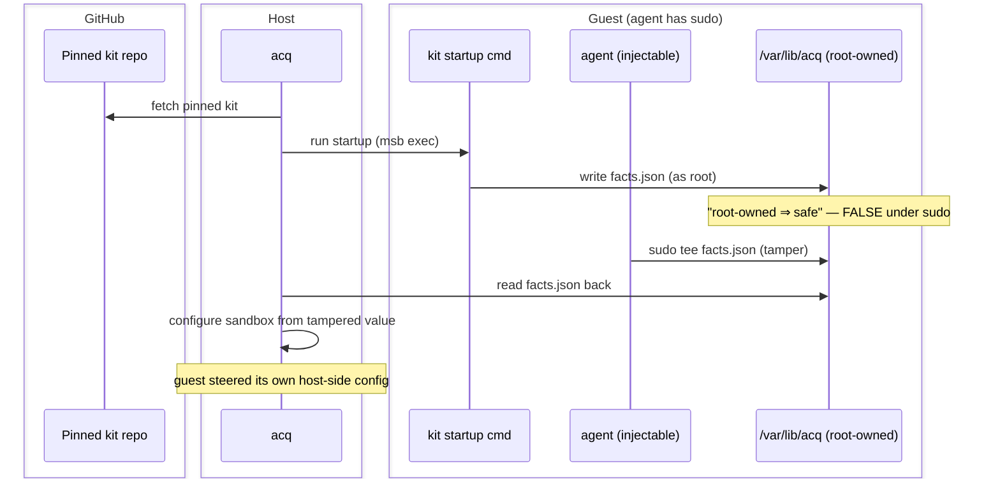
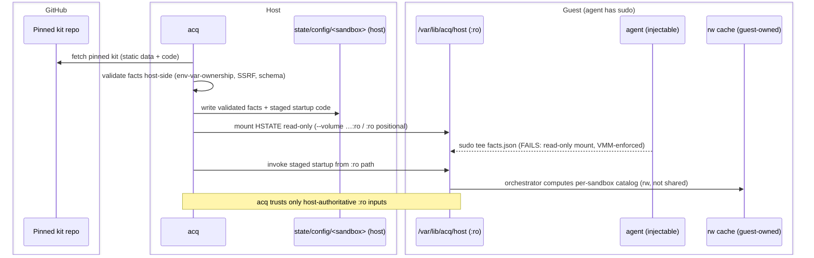

# ADR-0030: Host-Authoritative Sandbox Configuration (no trust in guest-generated state)

## Context and Problem Statement

acq deliberately gives the in-sandbox `agent` user **passwordless sudo** (see
`AGENTS.md`, and the msb agent-user provisioning in
`acq.backends/msb.sh`: `/etc/sudoers.d/90-acq-agent … NOPASSWD:ALL`). This is an
intentional convenience: the sandbox — not the guest OS user boundary — is the
security boundary (ADR-0005, ADR-0011). A consequence follows that has not been
stated as a principle until now:

> **Inside the guest, root-ownership is not a trust boundary against the agent.**
> A prompt-injected agent can `sudo` to root and rewrite any file in the guest,
> including anything under a root-owned path such as `/var/lib/acq/`.

acq currently violates the safe form of this in two ways:

1. **acq reads guest-written state back and acts on it.** Four content-bearing
   markers under the guest path `/var/lib/acq/` are written by acq (via
   `msb exec -u 0`), then read back on a later session/restart and used to
   *configure the sandbox*:

   | Marker | Written (host fn) | Read back → effect |
   |---|---|---|
   | `agent` | `acq_backend_provision` | selects which binary the re-attach launches |
   | `workspace` | `acq_backend_provision` | sets the session working directory (`-w`) |
   | `ssh-auth-sock` | ssh-agent bridge starter | sets `-e SSH_AUTH_SOCK=…` for git/ssh signing |
   | `kit-env` | `_acq_msb_apply_kit_dir` | replays kit `environment[]` as `-e NAME=value` on every session |

   Each read is charset/token-hardened against *shell injection* (e.g.
   `_acq_msb_safe_agent_token`, the `kit-env` awk name re-validation), so a
   tampered marker cannot break out of an `sh -c`. But the hardening does not stop
   a sudo-capable guest from setting a **valid-but-malicious value**: redirect
   `SSH_AUTH_SOCK`, change the launched agent to another allowed token, change the
   cwd, or inject arbitrary environment variables into the agent process. The
   guest can influence its own host-driven reconfiguration.

2. **acq re-runs guest-resident kit code across a restart.** On msb, kit
   `files[]` (including startup scripts and config-merge programs such as the
   provider kits' `merge-*-config.mjs`) are copied *into the guest* at provision
   and then `chown`ed to the agent. acq's restart heal
   (`acq_backend_ensure_kits_applied`) re-runs the `startup` phase by invoking
   those **guest-resident** files. A sudo-capable agent can overwrite a startup
   script or normalizer *between* provision and the next restart; the heal then
   executes the tampered code. This is the general form of the
   "provider-facts file is root-owned, therefore safe" error flagged during
   review of the `agentic-coding-patterns` neutral model-provider discovery work
   — root-ownership is not the barrier it appears to be.

A concrete instance motivating this ADR: the neutral model-provider discovery
design (patterns ADR 0003) originally had each provider kit **write** a facts
file to a root-owned guest path in its own `startup` command, and claimed that
path was "not agent-writable." Under passwordless sudo it is. A planted or
tampered facts file would let the guest steer model routing (and, absent the
host-side validation this ADR requires, an SSRF/credential-misuse surface).

### Presence-only gates (a lower-severity variant of the same problem)

Four other `/var/lib/acq/` files are `touch`/`test -f` idempotency gates
(`install-<cksum>`, `agent-installed-<agent>`, `agent-user-ready`, `oci-ready`).
Their *content* is never consumed, but a guest can pre-`touch` them to
**suppress** a provisioning step (skip an install, skip the agent-user/sudoers
setup, skip OCI setup). That is a downgrade/DoS on setup rather than injection,
but it is the same root cause: acq relies on guest-resident state to make a
provisioning decision.

## Decision Drivers

- **The only enforceable boundary is host↔guest.** A value acq holds on the host
  (in memory, or in a host file the guest cannot write) is beyond the reach of a
  sudo-capable guest; a value living in the guest is not.
- **Least privilege / integrity** (AC-6, SI-7): the sandbox's configuration must
  not be forgeable by the workload it sandboxes.
- **Preserve the sandbox-is-the-boundary model** (ADR-0005/0011): this ADR does
  **not** remove passwordless sudo. It removes acq's *reliance on* guest-writable
  state for configuration, which is orthogonal.
- **No code execution on the host** (the deciding factor that rejected patterns
  ADR 0003's "Option 2"): acq may read *static data* from a pinned kit directory
  on the host, but must not *execute* kit-shipped code on the host, next to real
  credentials.
- **Backend parity and Windows path forms**: any new mount must work on both
  msb (`--volume host:guest:ro`) and sbx (`:ro` positional), and respect the
  host/guest path-form split (ADR-0029).
- **Fail-soft preservation**: the current marker writes are best-effort
  (`|| true`); the migration must not turn a transient state-dir hiccup into a
  hard provision abort where it was previously survivable.

## The principle (normative)

> **acq MUST NOT rely on guest-generated or guest-tamperable state to configure
> the sandbox.** Every input acq trusts to make a configuration or
> lifecycle decision — data *and* code — MUST be one of:
>
> - **(H1) Host-resident and mounted read-only into the guest** (the VMM/mount
>   layer enforces read-only; guest sudo cannot override it), or
> - **(H2) Held on the host and supplied at exec time** from acq's own state
>   (never read back from the guest).
>
> The guest may freely write its own genuinely-owned read-write state (the
> workspace, a per-sandbox cache, kit scratch) — acq simply must not read that
> state back and treat it as authoritative configuration.

## Considered Options (trusted startup execution)

The data case (H1/H2) is straightforward. The harder case is **running trusted
code in the guest at startup** — acq's restart heal must invoke a kit's
`startup`/normalizer logic without trusting a guest-resident, agent-tamperable
copy of it. Three options were considered:

1. **Mount the kit's executable payload read-only and invoke it from the `:ro`
   path.** acq stages the pinned kit's startup scripts/normalizers from the
   host-side kit directory it already fetched into a per-sandbox host config
   dir, mounts that dir `:ro` into the guest, and the heal executes
   `sh /var/lib/acq/host/<kit>/<script>` from the read-only mount. The guest can
   read and execute it but cannot rewrite it. Uniform with the data case (H1):
   *all* acq-trusted inputs, data and code, are host-materialized and `:ro`.

2. **Re-push the code fresh from the host on every heal.** Before each startup
   run, acq re-`copy`s the script from the pinned kit dir, overwriting any
   tampering, then execs it from a normal (guest-writable) path. No new mount,
   but a **TOCTOU window** remains between the copy and the exec (a racing sudo
   process can rewrite it in between), and it fights the existing
   copy-then-chown-to-agent flow. Strictly weaker than (1).

3. **Register the script via msb `--script-path` and rely on native replay.**
   Rejected on mechanism, not security: ADR-0017 established (source-verified)
   that a bare `--script-path` registration is *inert at boot* on the pinned msb
   — `start_detached` replays only `runtime.entrypoint`/`runtime.cmd` — and that
   a native `msb start` cannot even boot a secret-bound sandbox without acq's
   secret injection. So this reduces in practice to acq invoking the staged file
   itself, i.e. to option (1) or (2), and adds nothing.

## Decision Outcome

**Chosen: Option 1 — host-materialize acq-trusted inputs (data *and* code) and
mount them read-only; invoke code from the `:ro` path.**

Concretely, this ADR introduces two mechanisms and a staged migration.

### Mechanism 1 — Per-sandbox host config directory, mounted `:ro`

- A new per-sandbox host directory under the acq state tree, keyed by
  backend + sandbox name using the same sanitized-filename + raw-name-checksum
  scheme as the existing provenance/CLI-kit records
  (`acq.backends/common.sh`): e.g.
  `${ACQ_STATE_DIR}/config/<backend>.<sandbox>.<sum>/`.
- acq populates it **on the host** at provision (and refreshes it on the heal):
  static facts/config read from the **pinned** kit directories acq already
  fetches (`_acq_msb_fetch_kit`) and validates on the host — never by executing
  kit code on the host.
- acq mounts that directory into the guest **read-only** at a well-known path:
  `/var/lib/acq/host/` (`:ro`). On msb via `--volume <hostdir>:/var/lib/acq/host:ro`;
  on sbx via the `:ro` positional the CLI already honors. This relies on backend
  mount/export semantics, not Unix ownership inside the guest: sbx already
  enforces read-only extra mounts, and msb 0.7.2 was live-verified to export the
  virtiofs mount read-only even when guest root can make the guest-visible mount
  flag appear `rw`. acq also probes that guest root cannot create a file in the
  mount before it rewrites `readonly: true` startup code to that path; if the
  probe fails, acq falls back to the legacy guest-copy path and warns. If a future
  msb changes `--volume ...:ro` parsing or enforcement, acq must raise or gate
  its minimum msb version before relying on ADR-0030. Host and guest path forms
  follow ADR-0029.
- The mount root and `kit-files/` subtree are traversable but not listable (`0711`)
  so the guest `agent` user can open/execute known read-only kit payload paths,
  while flat acq-internal keys stay host-private (`0600`). This is also a
  host-side visibility relaxation: any local host user who can guess a staged
  `kit-files/<slug>.<crc>` path can read the `0555` payload, so only non-sensitive
  trusted code from public/pinned kits belongs there.
- In-guest consumers (kit orchestrators, the agent) **read** from
  `/var/lib/acq/host/…` but cannot write it. Guest-owned read-write state stays
  on separate rw paths.

### Mechanism 2 — Trusted startup execution from the `:ro` mount

- Kit `startup` code that acq re-runs across restarts is staged into the same
  per-sandbox `:ro` config dir and invoked from there by the heal, so a restart
  always executes the host-authoritative (pinned) copy, not a guest-tampered one.
- **Identification is declared, not inferred.** A kit `files[]` entry marks
  trusted code with `readonly: true`. acq stages such a file onto the host config
  dir (under `kit-files/<path-slug>.<crc>`), does **not** `msb copy` it into the
  guest's writable filesystem, and rewrites any startup-command argv token that
  *exactly equals* the file's declared guest path to its `:ro`-mount path (whole
  token only, so a `--flag <data-path>` value is left untouched). Inference from
  "is this path referenced by a startup command" is deliberately rejected: trust
  is a per-file property the kit author asserts, and a data file the command also
  reads (e.g. `opencode.jsonc`) must stay a normal guest-writable drop.
- A file **without** `readonly: true` is unchanged: copied into the guest and
  invoked by its guest path (full backward compatibility; no shipped kit changes
  behavior until it opts in). If an existing sandbox predates the
  `/var/lib/acq/host` mount, acq warns and falls back to this legacy guest-copy
  behavior for `readonly: true` files too, rather than rewriting startup argv to a
  path that does not exist; recreating the sandbox restores the tamper-resistant
  read-only path.
- Kits that genuinely must *compute* runtime state in-guest still may — they
  write their output to a guest-owned **rw** path (e.g. a per-sandbox catalog
  cache), which acq never treats as authoritative configuration. (This is
  exactly the boundary patterns ADR 0003 now draws: read-only provider *facts*
  from the `:ro` mount; rw *catalog* generated per-sandbox at startup, never
  shared across sandboxes.)

> **Cross-repo dependency.** The `readonly: true` files[] field is additive to
> the neutral `hybrid/v1` kit spec and must be adopted by the provider/harness
> kits in `GSA-TTS/agentic-coding-patterns` for their trusted code (e.g.
> `usai-provider`'s `merge-global-config.mjs`, and ADR 0003's provider
> normalizers). The two sides are independently deployable: acq shipping first
> is inert until a kit opts in; a kit shipping the field first is ignored by an
> older acq (the file still copies into the guest). Tracked as sequenced work.

### Migration (one tracking issue, one PR, a commit per change)

Applied incrementally, each preserving the current best-effort fail-soft
behavior:

1. **Facts + `:ro` mount plumbing** (unblocks patterns ADR 0003 Layer 1): add the
   per-sandbox host config dir and the `:ro` mount on both backends.
2. **`agent`, `workspace`**: acq authors these already — write them to the host
   config dir and stop reading them back from the guest.
3. **`ssh-auth-sock`**: acq already knows the value (its own constant) — hold it
   host-side and inject at exec; stop reading it back.
4. **`kit-env`**: acq already parses each kit's `environment[]` on the host
   during apply — persist the validated env to the host config dir and replay
   from there; stop reading the guest marker.
5. **Presence gates** (`install-*`, `agent-installed-*`, `agent-user-ready`,
   `oci-ready`): move to the host config dir so a guest cannot forge them to
   suppress provisioning. Because the host config dir is keyed by sandbox name,
   clear these gate keys, plus conditionally-written instance keys such as
   `workspace` and `ssh-auth-sock`, at the start of a fresh provision so a
   same-named sandbox recreated after an out-of-band `msb rm` cannot inherit stale
   "already done" markers or session paths. (Lower severity; last.)

## Threat model and flows

Participants: **GitHub** (pinned kit source), **Host** (acq + real credentials +
the state tree), **Guest** (the microVM/container; agent has passwordless sudo).

### Rejected flow — kit writes trusted state in the guest

### Chosen flow — host-materialized, guest read-only

## Consequences

### Positive

- A prompt-injected, sudo-capable agent can no longer forge or tamper the state
  acq uses to configure the sandbox, launch the agent, set its environment, or
  re-run startup across restarts (AC-6, SI-7, SI-17).
- Establishes a single, uniform rule for all future acq-trusted inputs
  (data and code): host-materialized and `:ro`, or host-held and exec-injected.
- Directly unblocks patterns ADR 0003 Layer 1 with a real integrity guarantee,
  replacing the incorrect "root-owned ⇒ safe" claim.

### Negative / risks

- New per-sandbox mount and host state dir to create, refresh, and clean up
  (mirrors the existing `clones/`, `ports/`, provenance records — low novelty).
- Startup gains a small host-materialize + mount step. Bounded and one-time
  per provision/heal.
- Windows path-form handling (ADR-0029) must cover the new mount and any staged
  script paths.
- The current marker writes are best-effort; the migration must keep that
  fail-soft posture rather than converting a state-dir error into a hard abort.
- Host-side state can outlive a sandbox if it is removed outside acq or cleanup
  fails. Fresh provision must clear run-once gate keys before gated setup starts
  so the marker means "this sandbox instance completed this step," not "some
  same-named sandbox once completed this step," and must clear conditionally
  written instance keys before rewriting only the values that apply to the new
  sandbox.

### Neutral

- Passwordless sudo is unchanged. This ADR narrows what acq *trusts*, not what
  the agent *can do* inside its sandbox.
- No change to the neutral `hybrid/v1` kit vocabulary is required for the
  mechanism itself; the provider-facts declaration is specified in patterns
  ADR 0003.

## Links

- ADR-0005 — kits-from-patterns and the agent trust model (sandbox is the
  boundary; passwordless sudo rationale).
- ADR-0011 — msb backend and neutral kits (the exec-based marker/kit-apply paths
  this ADR migrates; the agent-user/sudoers provisioning).
- ADR-0017 — msb create-time startup-script staging (why native `--script-path`
  replay is inert and restart durability is acq's exec heal; grounds Option 3's
  rejection).
- ADR-0021 — host ssh-agent forwarding (the `ssh-auth-sock` marker migrated in
  step 3).
- ADR-0023 / ADR-0027 — neutral `volumes[]` and `:ro` workspace mounts (the
  read-only mount capability this ADR reuses).
- ADR-0029 — Windows host/guest path forms (applies to the new `:ro` mount).
- `agentic-coding-patterns` ADR 0003 (isolation) — neutral model-provider
  discovery; its Layer 1 provider-facts channel is the first consumer of this
  mechanism and references this ADR as the mechanism of record.
